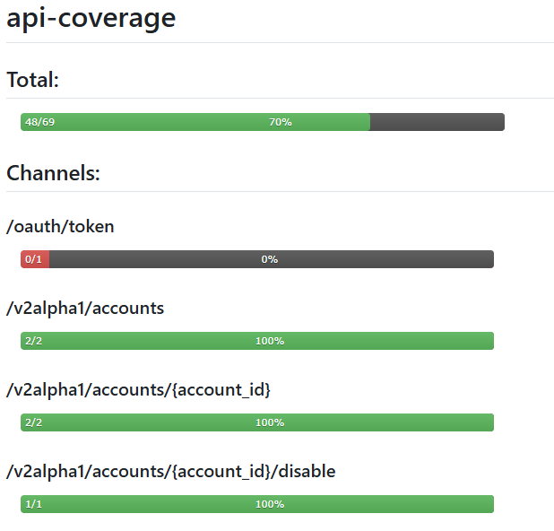

# cypress-api-coverage

[](https://badge.fury.io/js/%40ivamuno%2Fcypress-api-coverage)
[](https://opensource.org/licenses/MIT)

Cypress plugin to generate API coverage reports from your OpenAPI/Swagger specifications. This plugin is inspired by and built on top of [@neuralegion/cypress-har-generator](https://github.com/NeuraLegion/cypress-har-generator), extending its capabilities to specifically track and analyze backend API coverage.

## Features

- Generates API coverage reports based on OpenAPI/Swagger specifications
- Integrates with Cypress test runner
- Tracks API endpoint usage during test execution
- Provides detailed coverage statistics
- Supports TypeScript
- Compatible with Cypress versions >=4.4.1 <12.12.0 || >=12.17.0
- Operation-based coverage (URL + HTTP verb)
- Future planned coverage criteria:
  - Status code coverage
  - Response body schema coverage
  - Request parameter coverage

## Coverage Criteria

The plugin currently implements operation-based coverage, which tracks the usage of each unique combination of URL and HTTP verb defined in your OpenAPI specification. This means a test is considered to cover an endpoint when it makes a request to that URL with the specified HTTP method.

The plugin captures backend requests directly by generating HTTP Archive (HAR) files during test execution, similar to the approach used by [@neuralegion/cypress-har-generator](https://github.com/NeuraLegion/cypress-har-generator). These HAR files are then analyzed to determine API coverage against your OpenAPI specification.

Future versions will include additional coverage criteria:
- Status code coverage: Track which HTTP status codes are returned for each operation
- Response body schema coverage: Track which parts of the response schema are validated
- Request parameter coverage: Track usage of query parameters, path parameters, and request body fields

## Installation

```bash
npm install --save-dev @ivamuno/cypress-api-coverage
```

## Usage

1. First, import the commands in your `cypress/support/e2e.ts` file:

```typescript
import '@ivamuno/cypress-api-coverage/commands';

after(() => {
  cy.computeCoverage({
    suiteName: 'api-coverage',
    outDir: './cypress/hars',
    specsPath: './cypress/specs/api.yaml',
    includeHosts: [
      { host: 'https://api.host.io' },
      {
        host: 'https://bff.host.io',
        replacement: '/v2alpha1'
      }
    ],
    outputName: 'api-coverage'
  });
});
```

2. In each of your test files, add the following hooks:

```typescript
describe('API Tests', () => {
  before(() => {
    cy.recordApiRequests();
  });

  after(() => {
    cy.saveApiRequests();
  });

  // Your test cases here...
});
```

### Configuration

The `computeCoverage` command accepts the following configuration options:

```typescript
interface CoverageConfig {
  suiteName: string;        // Name of the test suite
  outDir: string;          // Directory to save HAR files
  specsPath: string;       // Path to your OpenAPI specification
  includeHosts: Array<{    // Hosts to include in coverage
    host: string;
    replacement?: string;  // Optional path replacement
  }>;
  outputName: string;      // Name of the output coverage report
}
```

### Example

Here's a complete example of how to use the plugin in your tests:

```typescript
describe('API Coverage Example', () => {
  before(() => {
    cy.startApiCoverage({
      specPath: './api/openapi.json',
      outputDir: './coverage/api'
    });
  });

  it('should test API endpoints', () => {
    cy.request('GET', '/api/users').then((response) => {
      expect(response.status).to.eq(200);
    });
  });

  after(() => {
    cy.generateApiCoverageReport();
  });
});
```

### Output



## Contributing

Contributions are welcome! Please feel free to submit a Pull Request.

## License

This project is licensed under the MIT License - see the [LICENSE](LICENSE) file for details.

## Author

- Iván Muñoz ([@ivamuno](https://github.com/ivamuno))

## Acknowledgments

- Built on top of [@neuralegion/cypress-har-generator](https://github.com/NeuraLegion/cypress-har-generator)
- Uses [@redocly/openapi-core](https://github.com/Redocly/openapi-core) for OpenAPI specification handling